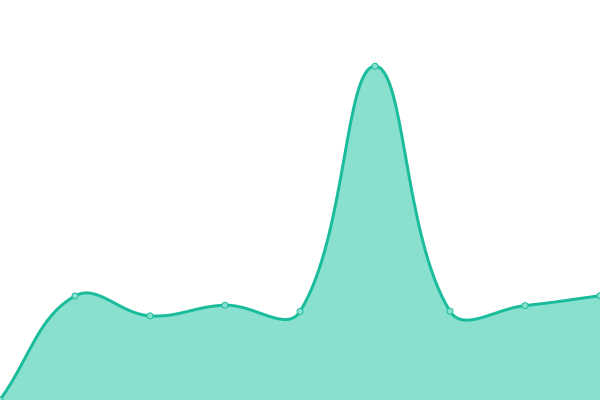

# [📈 Live Status](https://flvanney.github.io/OSAMuptime): <!--live status--> **🟩 All systems operational**

This repository contains the open-source uptime monitor and status page for [FrancoVanney](https://flvanney.github.io/OSAMuptime), powered by [Upptime](https://github.com/upptime/upptime).

With [Upptime](https://upptime.js.org), you can get your own unlimited and free uptime monitor and status page, powered entirely by a GitHub repository. We use [Issues](https://github.com/flvanney/OSAMuptime/issues) as incident reports, [Actions](https://github.com/flvanney/OSAMuptime/actions) as uptime monitors, and [Pages](https://flvanney.github.io/OSAMuptime) for the status page.

<!--start: status pages-->
<!-- This summary is generated by Upptime (https://github.com/upptime/upptime) -->
<!-- Do not edit this manually, your changes will be overwritten -->
<!-- prettier-ignore -->
| URL | Status | History | Response Time | Uptime |
| --- | ------ | ------- | ------------- | ------ |
|  [Extranet](https://extranet.osam.org.ar/) | 🟩 Up | [extranet.yml](https://github.com/flvanney/OSAMuptime/commits/HEAD/history/extranet.yml) | 

 1408ms
     
 | 

<a href="https://flvanney.github.io/OSAMuptime/history/extranet">97.95%</a>
    

|  [AOL](https://extranet.osam.org.ar/OSAM) | 🟩 Up | [aol.yml](https://github.com/flvanney/OSAMuptime/commits/HEAD/history/aol.yml) | 

 950ms
     
 | 

<a href="https://flvanney.github.io/OSAMuptime/history/aol">97.96%</a>
    

|  [Asociados](https://extranet.osam.org.ar/Asociados) | 🟩 Up | [asociados.yml](https://github.com/flvanney/OSAMuptime/commits/HEAD/history/asociados.yml) | 

 656ms
     
 | 

<a href="https://flvanney.github.io/OSAMuptime/history/asociados">97.97%</a>
    

|  [Cartilla](https://extranet.osam.org.ar/Consulta/cartilla) | 🟩 Up | [cartilla.yml](https://github.com/flvanney/OSAMuptime/commits/HEAD/history/cartilla.yml) | 

 490ms
     
 | 

<a href="https://flvanney.github.io/OSAMuptime/history/cartilla">97.98%</a>
    

|  [Farmacias](https://extranet.osam.org.ar/Consulta/farmacias) | 🟩 Up | [farmacias.yml](https://github.com/flvanney/OSAMuptime/commits/HEAD/history/farmacias.yml) | 

 287ms
     
 | 

<a href="https://flvanney.github.io/OSAMuptime/history/farmacias">97.99%</a>
    

|  [Delegaciones](https://extranet.osam.org.ar/Consulta/) | 🟩 Up | [delegaciones.yml](https://github.com/flvanney/OSAMuptime/commits/HEAD/history/delegaciones.yml) | 

 167ms
     
 | 

<a href="https://flvanney.github.io/OSAMuptime/history/delegaciones">98.00%</a>
    

|  [Google](https://www.google.com) | 🟩 Up | [google.yml](https://github.com/flvanney/OSAMuptime/commits/HEAD/history/google.yml) | 

 83ms
     
 | 

<a href="https://flvanney.github.io/OSAMuptime/history/google">100.00%</a>
    

<!--end: status pages-->

[**Visit our status website →**](https://flvanney.github.io/OSAMuptime)

## 📄 License

- Powered by: [Upptime](https://github.com/upptime/upptime)
- Code: [MIT](./LICENSE) © [FrancoVanney](https://flvanney.github.io/OSAMuptime)
- Data in the `./history` directory: [Open Database License](https://opendatacommons.org/licenses/odbl/1-0/)
